# Siggraph 2019 OptiX 7 Course Tutorial Code

## Latest Updates:

* 1/3/2020: Several fixes and documentation adds to make project
  compile with CentOS 7 (ie, oder gcc)

* 1/1/2020: Changed all examples to enable full optimization level
   and most appropriate pipeline config for the specific example (single GAS)
   
# About this Tutorial/Repository

This tutorial was created to accompany the 2019 Siggraph course on
"RTX Accelerated Ray Tracing with OptiX" 
(slides available on
https://drive.google.com/open?id=1_IYHwAZ4EoMcDmS0TknP-TZd7Cwmab_I ). 

The aim of this repo is to serve as a "tutorial" in how to set
up a full Scene - i.e., OptiX Context, Module, Programs, Pipeline,
Shader Binding Table (SBT), Accel Struct (AS), Build Inputs, Texture
Samplers, etc., in the newly introduced OptiX 7. 

To do this, this repo intentionally does not provide *one* example
that has the final code, but instead is split into 12 smaller
examples, each of which modifies and extends the previous one,
hopefully in a way that it is relatively easy to spot the differences
(i.e., to spot what exactly had to be added to go from "A" to "B").

Note this tutorial does (intentionally) not end in a
overwhelming-wow-factor full-featured renderer - its aim is to *only*
help you get *started* with OptiX 7, exactly up to the point where
"Textbook Ray Tracing 101" would usually kick in.

With that - enjoy!

PS: I tried my best to make sure that code is correct, and will work
out of the box in both Linux and Windows. However, I assume it's safe
to expect that some one or other bug has crept in somewhere that I
haven't found yet. If you do find one, please feel free to let me know
via email or bug report, or send a push request, so others will be
spared from finding it again. Any other feedback is welcome, too!


# Building the Code

This code was intentionally written with minimal dependencies,
requiring only CMake (as a build system), your favorite
compiler (tested with Visual Studio 2017 and 2019 under Windows, and GCC under
Linux), and the OptiX 7 SDK (including CUDA 10.1 and NVIDIA driver recent
enough to support OptiX).

## Dependencies

- a compiler
    - On Windows, tested with Visual Studio 2017 and 2019 community editions
    - On Linux, tested with Ubuntu 18 and Ubuntu 19 default gcc installs
- CUDA 10.1
    - Download from developer.nvidia.com
    - on Linux, suggest to put `/usr/local/cuda/bin` into your `PATH`
- latest NVIDIA developer driver that comes with the SDK
    - download from http://developer.nvidia.com/optix and click "Get OptiX"
- OptiX 7 SDK
    - download from http://developer.nvidia.com/optix and click "Get OptiX"
    - on linux, suggest to set the environment variable `OptiX_INSTALL_DIR` to wherever you installed the SDK.  
    `export OptiX_INSTALL_DIR=<wherever you installed OptiX 7.0 SDK>`
    - on windows, the installer should automatically put it into the right directory

The only *external* library we use is GLFW for windowing, and
even this one we build on the fly under Windows, so installing
it is required only under Linux. 

Detailed steps below:

## Building under Linux

- Install required packages

    - on Debian/Ubuntu:
```
    sudo apt install libglfw3-dev cmake-curses-gui
```
    - on RedHat/CentOS/Fedoral (tested CentOS 7.7):
```
    sudo yum install cmake3 glfw-devel freeglut-devel
```
- Clone the code
```
    git clone https://gitlab.com/ingowald/optix7course.git
    cd optix7course
```

- create (and enter) a build directory
```
    mkdir build
    cd build
```

- configure with cmake
    - Ubuntu:
```
    cmake ..
```
    - CentOS 7:
```
    cmake3 ..
```

- and build
```
    make
```

## Building under Windows

- Install Required Packages
	- see above: CUDA 10.1, OptiX 7 SDK, latest driver, and cmake
- download or clone the source repository
- Open `CMake GUI` from your start menu
	- point "source directory" to the downloaded source directory
	- point "build directory" to <source directory>/build (agree to create this directory when prompted)
	- click 'configure', then specify the generator as Visual Studio 2017 or 2019, and the Optional platform as x64. If CUDA, SDK, and compiler are all properly installed this should enable the 'generate' button. If not, make sure all dependencies are properly installed, "clear cache", and re-configure.
	- click 'generate' (this creates a Visual Studio project and solutions)
	- click 'open project' (this should open the project in Visual Studio)


# Examples Overview
	
## Example 1: Hello World 

This is simplest example, that only initializes the OptiX Library,
prints "hello world", and exits. It's pretty much testing only whether
your SDK, driver, and PATH/LD_LIBRARY_PATH are properly set up to
build, link, and run this tutorial.

This is how this should look like in Linux:


And here, in Windows:
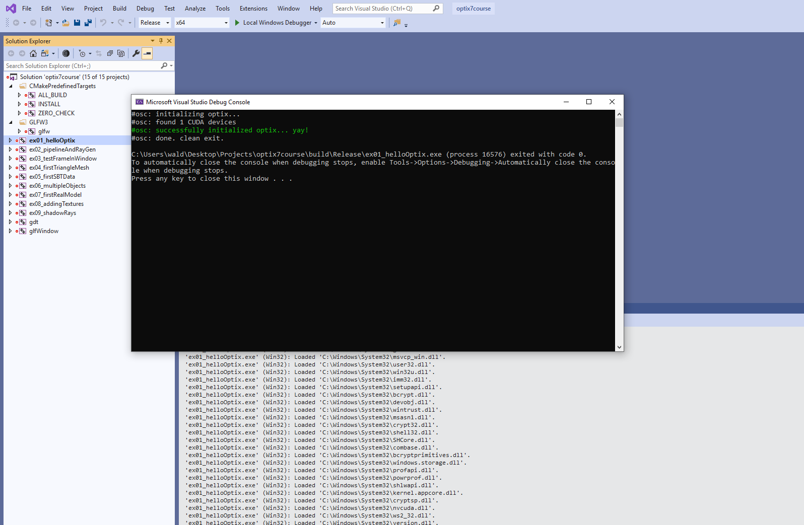

**Note:** if you do not see this output file, you may have a driver that
does not work properly with OptiX 7 or some other cause. Normally the
console window will disappear before you can see the error. To run and
see the console window's messages, use the Visual Studio option "Start
Without Debugging" (or hit Ctrl+F5), which will keep the console window
visible after exit. The other option (or for Linux) is to run the program
in a console window, e.g., run `build\Debug\ex01_helloOptix.exe`

## Example 2: First Pipeline Setup and Raygen Program

This is the first "real" OptiX example, and maybe somewhat
surprisingly, the biggest "step" in all the examples. 

The actual raygen program that this example launches is actually
very (!) small, and pretty much trivial; and there are no other programs,
not even geometry, nor a single ray being traced ... but to launch
this simple raygen program we nevertheless have to go through the
entire process of creating Modules, Programs, and, in particular, a
valid "Shader Binding Table" (SBT), before we can launch our little
raygen sample.

On the upside: Once this initial setup is done, everything will get
*much* simpler in the following examples.

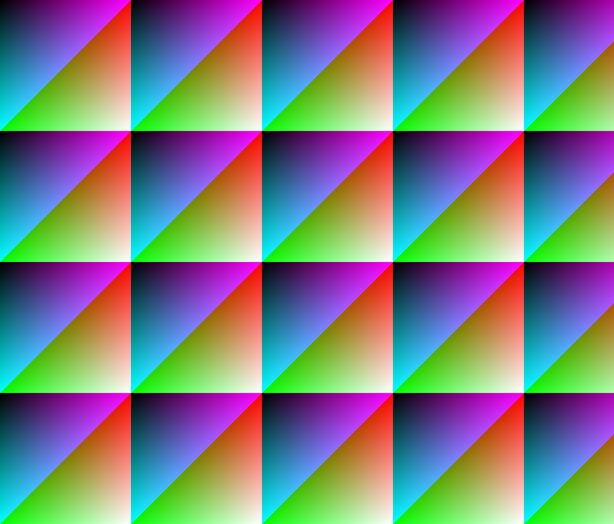

## Example 3: Rendering in a GLFW Window 

Rendering to files is nice and well, but *probably* you want to
eventually do some online rendering; so this example moves the
previous raygen example into a 3D viewer window (created and run using
GLFW). For now this viewer just displays the rendered images, with no
user interaction.

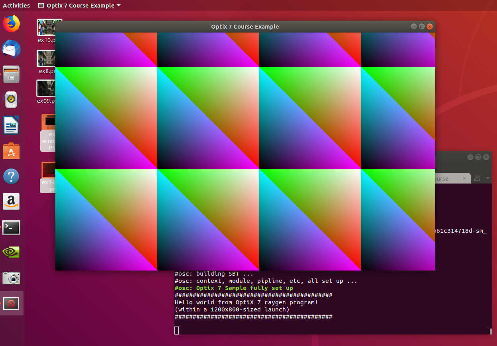
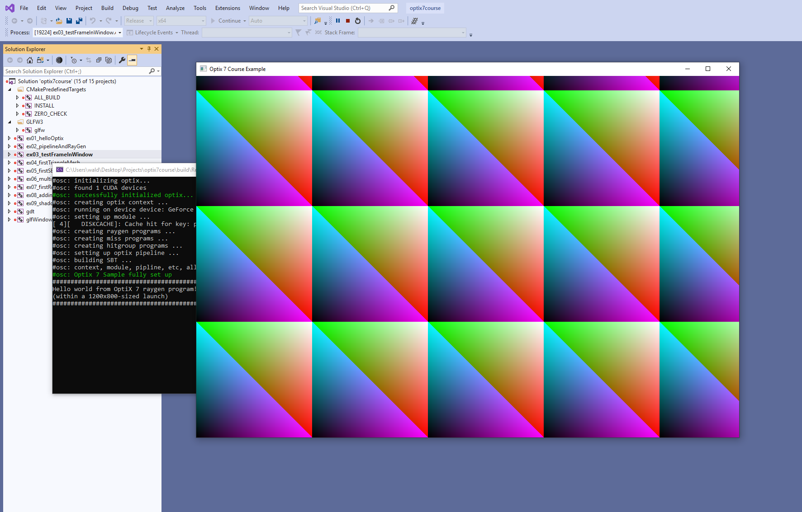

## Example 4: Creating a first Triangle Mesh and Accel Struct 

Though the previous setup steps were important to get right, eventually 
you want to use a ray tracer to trace some real rays against some
real geometry. 

This example introduces how to create some Triangle Mesh Geometry (in
this example, two simple, hardcoded, cubes), how to build an
Acceleration Structure over this "BuildInput", and how to trace rays
against it. To do this we also need to introduce a simple camera model.

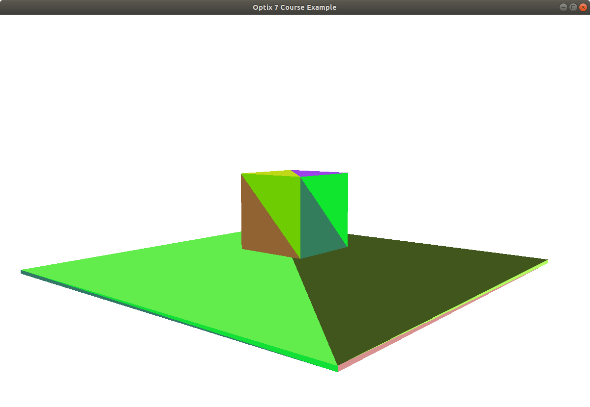

## Example 5: First Shader Binding Table (SBT) Data 

The earlier examples *created* an SBT (they had to, else they couldn't
have executed any OptiX launch), but didn't actually put any data into
the SBT. This example introduces how to do that, by putting just some
simple constant per-object color into the mesh's SBT entry, then shading
it based on the surface normal's angle to the view ray.

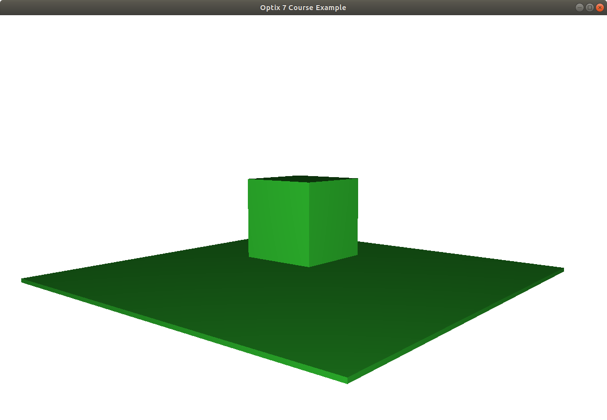

## Example 6: Multiple Triangle Meshes 

This example introduces the concept of having multiple different
meshes (each with their own programs and SBT data) into the same accel
structure. Whereas the previous example used two (same color) cubes in
*one* triangle mesh, this example split this test scene into two
meshes with one cube (and one color) each.

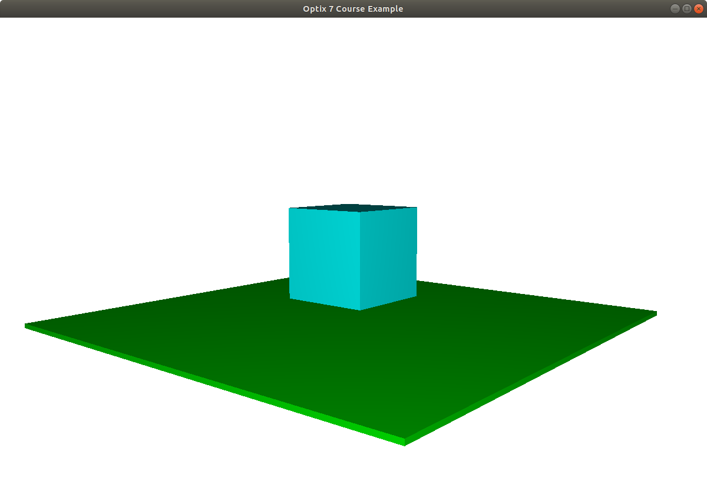

## Example 7: First Real Model

This example takes the previous "multiple meshes" code unmodified, but
introduces a simple OBJ file format parser (using [Syoyo Fuyita's
tinyobj](https://github.com/syoyo/tinyobjloader), and hooks the resulting triangle meshes up to
the previous example's render code.

For this example, you must download the [Crytek Sponza model](https://casual-effects.com/data/) and unzip it to the (non-existent, until you create it) subdirectory `optix7course/models`.

And la-voila, with exactly the same render code from Sample 6, it
suddenly starts to take shape:

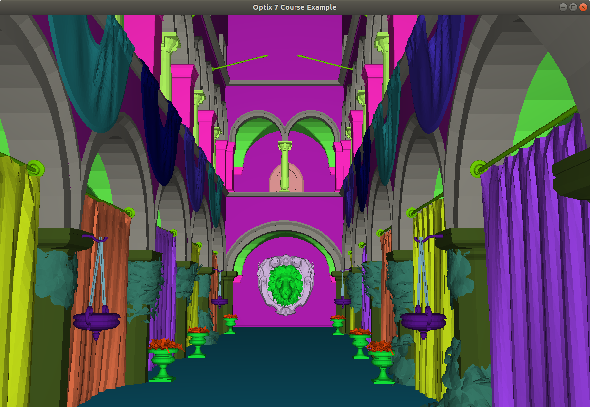

## Example 8: Adding Textures via CUDA Texture Objects

This example shows how to create and set up CUDA texture objects on
the host, with the host passing those to the device via the SBT, and how to use
those texture objects on the device. This one will take a bit of time
to load in Debug - it's worth the wait! Or simply build and run in Release.

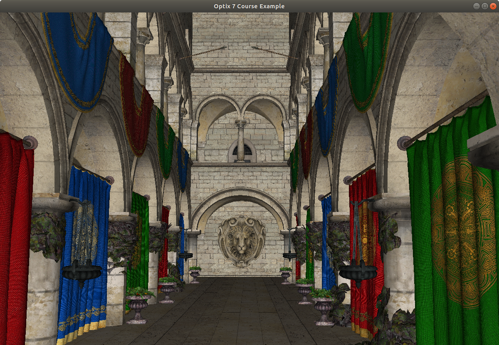

## Example 9: Adding a second ray type: Shadows

This is the last example that focuses on host-side setup, in this
case adding a second ray type (for shadow rays), which also requires
changing the way the SBT is being built. 

This sample also shows how to shoot secondary rays (the shadow rays)
in device programs, how to use an any-hit program for the shadow rays,
how to call *optixTerminateRay* from within an any-hit program, and how
to use the optixTrace call's SBT index/offset values to specify the
ray type.

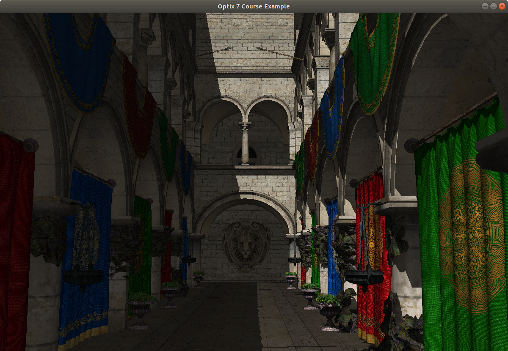

## Example 10: Soft Shadows

Whereas the first 9 examples focused on how to perform all the
required host-side setup for various incremental features, this
example can now start to focus more on the "ray tracing 101" style
additions that focus what rays to trace to add certain rendering
effects. 

This simple example intentionally only adds soft shadows from area
lights, but extending this to add reflections, refraction, diffuse
bounces, better material models/BRDFs, etc., should from now on be
straightforward. 

Please feel free to play with adding these examples ... and share what
you did!


## Example 11: Simple Denoising (LDR, color only)

This example takes the code from the previous example and simply runs
the optix denoiser on the final frame (ie, color) buffer computed by
this optix launch. It does not store any albedo or normal buffers, 
not compute HDR intensity, etc. 

To fully see the impact of denoising *without* progressive resampling,
feel free to turn denoising and/or progressive refinemnt on and off
via the 'd' (denoising) and 'a' (accumulate) keys.

Example 11, single sample per pixel, *no* denoising:
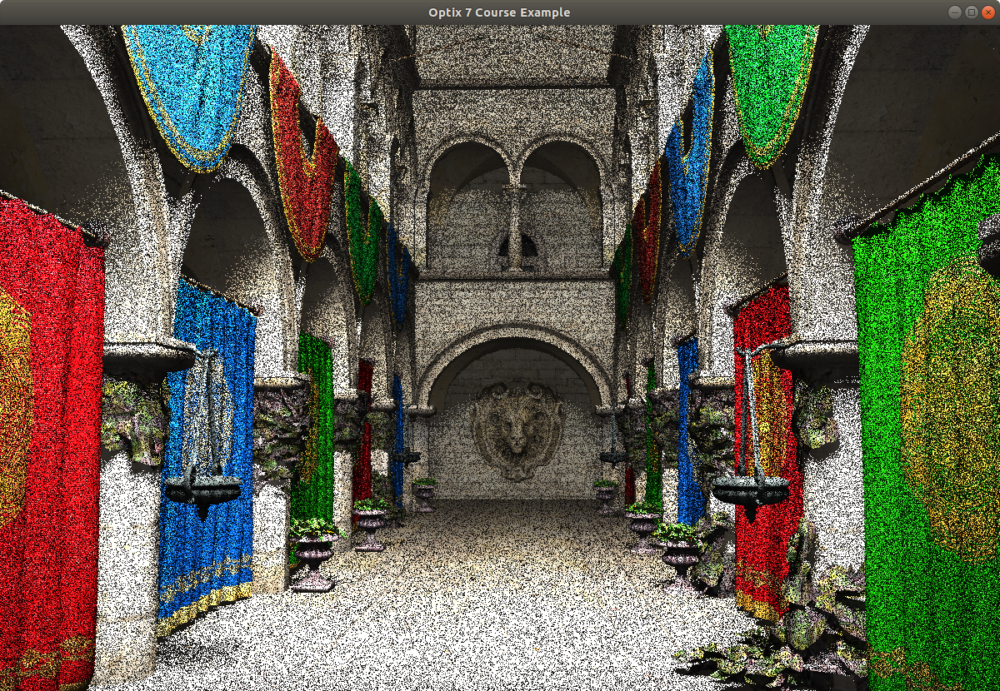

The same, with denoiser turned on:
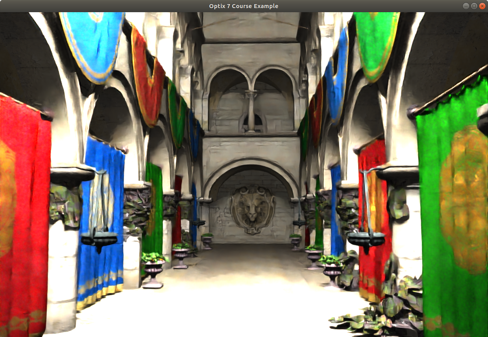


## Example 12: Denoising with HDR and separate Normal Channel

This example improves on the simple denoising by computing
a separate normal buffer (which improves the denoiser quality), and
by doing denoising in HDR, with an added gamma pass *after* denoising.

As with example 11, to fully see the impact of denoising *without*
progressive resampling, feel free to turn denoising and/or progressive
refinemnt on and off via the 'd' (denoising) and 'a' (accumulate)
keys.

Example 12, single sample per pixel, *no* denoising:


The same, with denoiser turned on:


## Example 13: It's up to you ...

From here on, there are multiple different avenues of how to add to
this simple viewer, in terms of visual features, performance, kind
and complexity of geometry, etc. In no particular order, and just
to serve as inspiration:

- Performance
   - Multi-GPU
   - Denoising
   - Better random numbers, better sampling, importance sampling, ...
   - ...
- Shading Effects
   - More/better light sources (eventually with importance sampling for multiple lights!)
   - Better camera model, with depth of field 
   - Alpha/Transparency Textures for Cut-outs (Tip: often used in landscape scenes)
   - Better material model / BRDF
   - Indirect Illumination / path tracing
   - ...
- Geometry-related Capabilities
   - Instancing, possibly multi-level instancing
   - Animation
   - Motion Blur
   - ...
- Viewer/app extensions
   - Camera motion based on user input
   - More importers (PBRT parser?)
   - Picking and editing
   - ...

Whichever of these - or other - features you might want to play around with: Let me know how it works out ... and have fun doing it!

